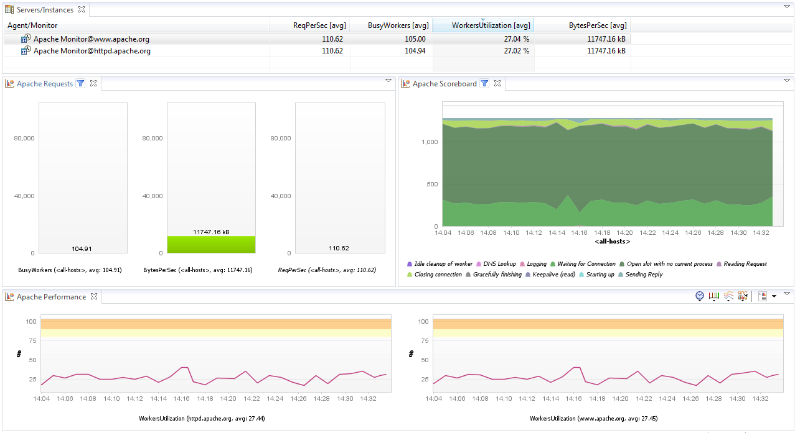
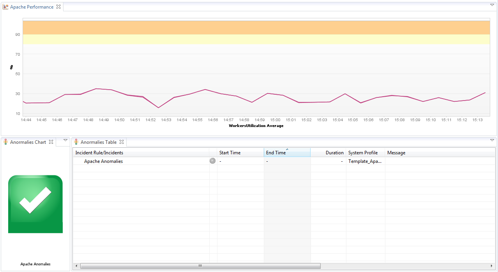

# Apache HTTP Server FastPack

## Overview

 The dynaTrace FastPack for Apache HTTP Server enables easy
out-of-the-box monitoring of Apache HTTP Server performance data. The FastPack consists of a custom Monitor, Sample Profile and Dashboards.

## Fast Pack Details

| Name | Apache HTTP Server Monitoring FastPack
| :--- | :---
| Version | 1.0.7
| dynaTrace Version | > 5.0
| Author | [MCG Systems](http://www.mcg-software.dk/) \- Rasmus Toelhoej
| License | [dynaTrace BSD](dynaTraceBSD.txt)
| Support | [Not Supported ](https://community.compuwareapm.com/community/display/DL/Support+Levels#SupportLevels-Community)

###FastPack Contents Fastpack Download ([for 5.5](dynaTrace_Apache_FastPack_dt55.dtp)) contains:

  * Apache Server Performance Dashboard 

  * Apache Anomalies Dashboard 

  * Sample System Profile 

  * Apache Monitor Plugin ([Plugin Page](https://community.compuwareapm.com/community/display/DL/Apache+Monitor+Plugin)) 

## Apache Server Performance Dashboard

The Apache Server Performance Dashboard enables you to easily monitor one or multiple Apache Monitors. It shows you

  * busy workers 

  * bytes per second 

  * requests per second 

  * a scoreboard 

  * a performance overview on workers utilization. 

## Apache Anomalies Dashboard

The Apache Anormalies Dashboard enables you to easily monitor average worker utilization as well as incidents. It shows you

  * Whether incidents have occurred on Apache 

  * The average worker utilization 

## Apache HTTP Server Monitor

The Monitor uses the Apache Server Status page provided by [mod_status](http://httpd.apache.org/docs/2.0/mod/mod_status.html) to gather its metrics. It monitors:

  * Total Accesses 

  * Total kBytes 

  * CPULoad 

  * Uptime 

  * ReqPerSec 

  * BytesPerSec 

  * BytesPerReq 

  * BusyWorkers 

  * IdleWorkers 

  * Worker Utilization 

  * Scoreboard Statuses 

For more information please see the [Apache Monitor Plugin](https://community.compuwareapm.com/community/display/DL/Apache+Monitor+Plugin) page.

## FastPack Information

The Apache HTTP Server FastPack contains everything to get started with Apache HTTP Server monitoring.

  * A system profile with a pre-configured monitor for monitoring Apache server 

  * A Apache Server Performance Dashboard for performance monitoring 

  * A Apache Anomalies Dashboard for monitoring average utilization and incidents 

## Installation

Just download and import the FastPack on your dynaTrace Server (see [Plugin Management](https://community.compuwareapm.com/community/display/DOCDT40/Plugin+Management))

